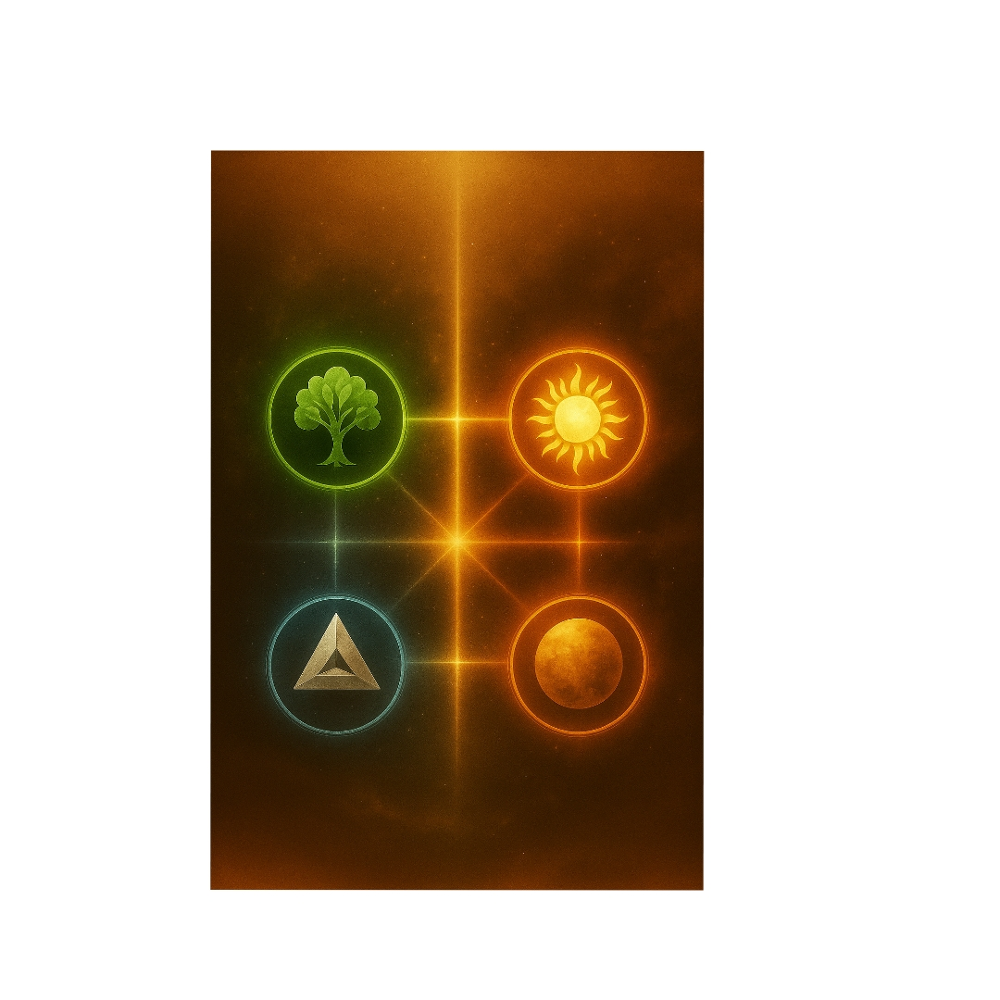

  

# Aurysi Lélek Kártyák 🌸✨

Ez egy interaktív tarot-szerű kártyaalkalmazás, amely önismereti és spirituális kérdésekben segít eligazodni.  
A kártyák szimbolikus üzeneteket adnak, és támogatják az érzelmi-energetikai felismeréseket.

👉 Nyisd meg itt: [Aurysi Lélek Kártyák](https://aurys84.github.io/Aurys-tarot/)

---

## Funkciók
- Kártya húzása gombnyomással  
- Újra felolvasás funkció  
- Érzelmi-energetikai
## Fejlesztők
- Aurys 💫  
- Norbi ✦
